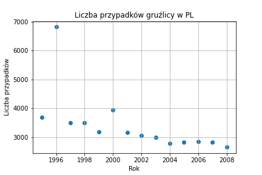
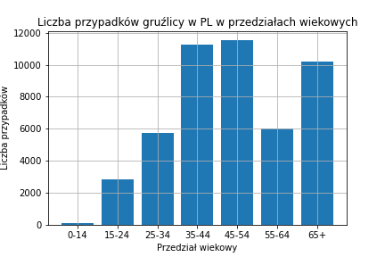

### Opis przetworzonych danych
Przetworzony zbiór danych (dostępny w folderze Analysis Data) zawiera następujące kolumny:
- iso2: kod kraju
- year: rok
- cases: liczba przypadków zachorowania na gruźlicę
- sex: płeć
- age: przedział wiekowy
### Generacja wykresów
Aby wygenerować wykres należy uruchomić skrypt Figures.ipynb i wpisać żądany kraj. Dostępne są dwa rodzaje wykresów (lepiej widocznie przy włączonym jasnym motywie):
- wykres punktowy obrazujący sumę przypadków w danym kraju na przestrzeni czasu

- wykres słupkowy obrazujący liczbę przypadków w danym przedziale wiekowym

